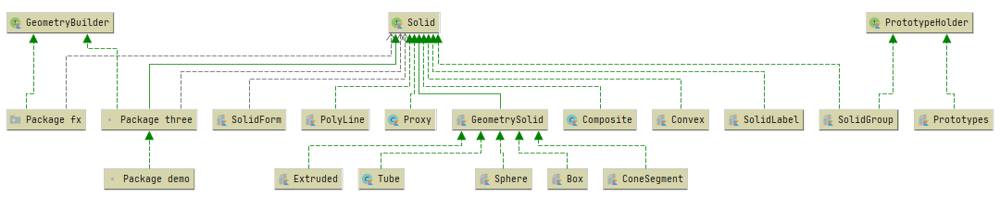
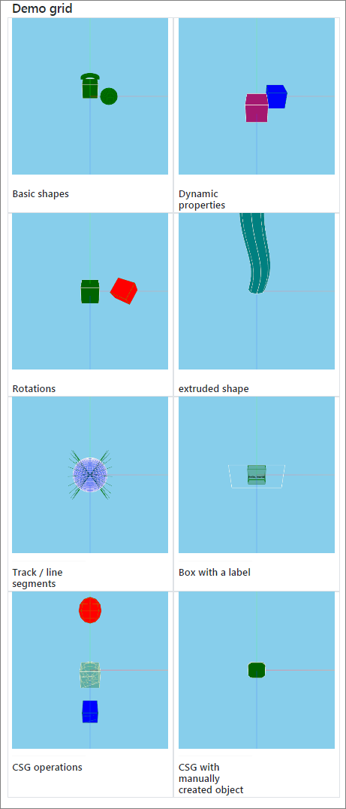

# DataForge Visualization Platform

## Table of Contents

* [Introduction](#introduction)
* [Requirements](#requirements)
* [Features](#features)
* [About DataForge](#about-dataforge)
* [Modules contained in this repository](#modules-contained-in-this-repository)
* [Visualization for External Systems](#visualization-for-external-systems)
* [Demonstrations](#demonstrations)
  * [Simple Example - Solid Showcase](#simple-example---solid-showcase)
  * [Full-Stack Application Example - Muon Monitor](#full-stack-application-example---muon-monitor-visualization)
  * [GDML Example](#gdml-example)

## Introduction

This repository contains a [DataForge](#about-dataforge)\-based framework
used for visualization in various scientific applications.

The main framework's use case for now is 3D visualization for particle physics experiments.
Other applications including 2D plots are planned for the future.

The project is developed as a [Kotlin multiplatform](https://kotlinlang.org/docs/reference/multiplatform.html)
application, currently targeting browser JavaScript and JVM.

## Requirements

JVM backend requires JDK 11 or later

## Features

The main framework's features for now include:
- 3D visualization of complex experimental set-ups
- Event display such as particle tracks, etc.
- Scales up to few hundred thousands of elements
- Camera move, rotate, zoom-in and zoom-out
- Scene graph as an object tree with property editor
- Settings export and import
- Multiple platform support

## About DataForge

DataForge is a software framework for automated scientific data processing. DataForge Visualization
Platform uses some of the concepts and modules of DataForge, including: `Meta`, `Configuration`, `Context`,
`Provider`, and some others.

To learn more about DataForge, please consult the following URLs:
* [Kotlin multiplatform implementation of DataForge](https://github.com/mipt-npm/dataforge-core)
* [DataForge documentation](http://npm.mipt.ru/dataforge/)
* [Original implementation of DataForge](https://bitbucket.org/Altavir/dataforge/src/default/)

## Modules contained in this repository

### [cern-root-loader](cern-root-loader)
>
> **Maturity**: EXPERIMENTAL

### [demo](demo)
>
> **Maturity**: EXPERIMENTAL

### [ui](ui)
>
> **Maturity**: EXPERIMENTAL

### [visionforge-core](visionforge-core)
>
> **Maturity**: DEVELOPMENT

### [visionforge-gdml](visionforge-gdml)
>
> **Maturity**: EXPERIMENTAL

### [visionforge-jupyter](visionforge-jupyter)
> Common visionforge jupyter module
>
> **Maturity**: EXPERIMENTAL

### [visionforge-markdown](visionforge-markdown)
>
> **Maturity**: EXPERIMENTAL

### [visionforge-plotly](visionforge-plotly)
>
> **Maturity**: EXPERIMENTAL

### [visionforge-server](visionforge-server)
>
> **Maturity**: EXPERIMENTAL

### [visionforge-solid](visionforge-solid)
>
> **Maturity**: DEVELOPMENT

### [visionforge-tables](visionforge-tables)
>
> **Maturity**: PROTOTYPE

### [visionforge-threejs](visionforge-threejs)
>
> **Maturity**: EXPERIMENTAL

### [demo/gdml](demo/gdml)
>
> **Maturity**: EXPERIMENTAL

### [demo/js-playground](demo/js-playground)
>
> **Maturity**: EXPERIMENTAL

### [demo/muon-monitor](demo/muon-monitor)
>
> **Maturity**: EXPERIMENTAL

### [demo/playground](demo/playground)
>
> **Maturity**: EXPERIMENTAL

### [demo/sat-demo](demo/sat-demo)
>
> **Maturity**: EXPERIMENTAL

### [demo/solid-showcase](demo/solid-showcase)
>
> **Maturity**: EXPERIMENTAL

### [ui/bootstrap](ui/bootstrap)
>
> **Maturity**: EXPERIMENTAL

### [ui/compose](ui/compose)
>
> **Maturity**: EXPERIMENTAL

### [ui/react](ui/react)
>
> **Maturity**: EXPERIMENTAL

### [ui/ring](ui/ring)
>
> **Maturity**: EXPERIMENTAL

### [visionforge-jupyter/visionforge-jupyter-common](visionforge-jupyter/visionforge-jupyter-common)
> Jupyter api artifact including all common modules
>
> **Maturity**: EXPERIMENTAL

### [visionforge-threejs/visionforge-threejs-server](visionforge-threejs/visionforge-threejs-server)
>
> **Maturity**: EXPERIMENTAL

**Class diagram:**

##### Prototypes

One of the important features of the framework is support for 3D object prototypes (sometimes
also referred to as templates). The idea is that prototype geometry can be rendered once and reused
for multiple objects. This helps to significantly decrease memory usage.

The `prototypes` property tree is defined in `SolidGroup` class via `PrototypeHolder` interface, and
`SolidReference` class helps to reuse a template object.

##### Styles

`VisionGroup` has a `styleSheet` property that can optionally define styles at the Group's
level. Styles are applied to child (descendant) objects using `Vision.styles: List<String>` property.

### visionforge-threejs

## Visualization for External Systems

The `visionforge` framework can be used to visualize geometry and events from external,
non-Kotlin based systems, such as ROOT. This will require a plugin to convert data model
of the external system to that of `visionforge`. Performing such integration is a work
currently in progress.

## Demonstrations

The `demo` module contains several example projects (demonstrations) of using the `visionforge` framework.
They are briefly described in this section, for more details please consult the corresponding per-project
README file.

### Simple Example - Solid Showcase

Contains a simple demonstration with a grid including a few shapes that you can rotate, move camera, and so on.
Some shapes will also periodically change their color and visibility.

[More details](demo/solid-showcase/README.md)

**Example view:**

### Full-Stack Application Example - Muon Monitor Visualization

A full-stack application example, showing the
[Muon Monitor](http://npm.mipt.ru/en/projects/physics#mounMonitor) experiment set-up.

[More details](demo/muon-monitor/README.md)

**Example view:**

### GDML Example

Visualization example for geometry defined as GDML file.

[More details](demo/gdml/README.md)

##### Example view:

## Stability and documentation

VisionForge is a modular library. Different modules provide different features with different API stability guarantees. All core modules are released with the same version, but with different API change policy. The features are described in module definitions below. The module stability could have the following levels:

* **PROTOTYPE**. On this level there are no compatibility guarantees. All methods and classes form those modules could break any moment. You can still use it, but be sure to fix the specific version.
* **EXPERIMENTAL**. The general API is decided, but some changes could be made. Volatile API is marked
  with `@DFExperimental` or other stability warning annotations.
* **DEVELOPMENT**. API breaking generally follows semantic versioning ideology. There could be changes in minor
  versions, but not in patch versions. API is protected with [binary-compatibility-validator](https://github.com/Kotlin/binary-compatibility-validator) tool.
* **STABLE**. The API stabilized. Breaking changes are allowed only in major releases.

Additionally, one should note that the VisionForge Json format impacts the reproducibility of stored vision fragments. There should not be any breaks of the format between major releases. All problems should be reported.

The documentation for the project is a work in progress. Please report any issues with missing, vague or wrong information. The contributions into documentation are quite welcome.

## Thanks and references
The original three.js bindings were made by [Lars Ivar Hatledal](https://github.com/markaren), but the project is discontinued right now.

All other libraries are explicitly shown as dependencies. We would like to express specific thanks to JetBrains Kotlin-JS team for consulting us during the work.
