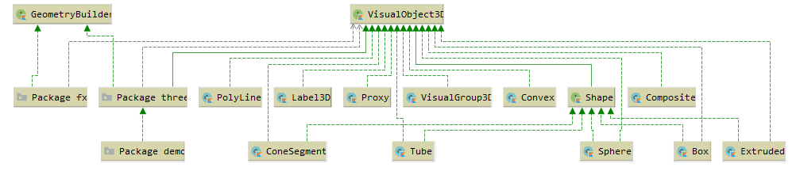
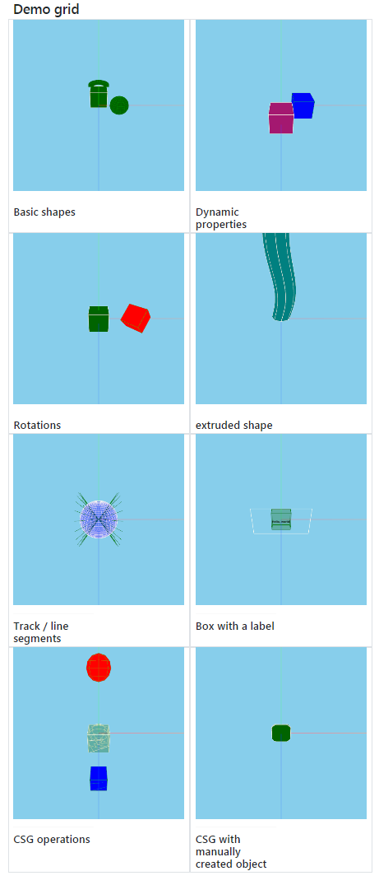
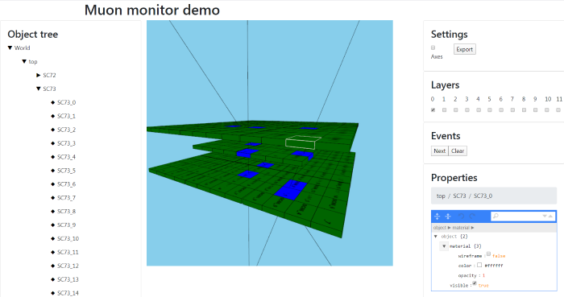
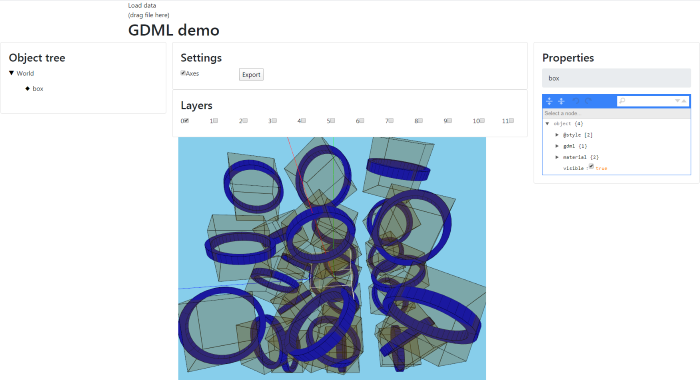

# DataForge Visualisation Platform

## Table of contents

* [Introduction](#introduction)
* [Features](#features)
* [Modules contained in this repository](#modules-contained-in-this-repository)
  * [dataforge-vis-common](#dataforge-vis-common)
  * [dataforge-vis-spatial](#dataforge-vis-spatial)
  * [dataforge-vis-spatial-gdml](#dataforge-vis-spatial-gdml)
  * [dataforge-vis-jsroot](#dataforge-vis-jsroot)
* [Demonstrations](#demo)
  * [Spatial Showcase](#spatial-showcase)
  * [Muon Monitor](#muon-monitor)
  * [GDML](#gdml)

## Introduction

This repository contains a [DataForge](#about-dataforge)\-based framework 
used for visualization in various scientific applications. 

The main framework's use case for now is 3D visualization for particle physics experiments. 
Other applications including 2D plots are planned for the future.

The project is being developed as a Kotlin multiplatform application, currently targeting browser 
JavaScript and JVM.

## Features

The main framework's features for now include:
- 3D visualization of complex experimental set-ups
- Event display such as particle tracks, etc.
- Scales up to few hundred thousands of elements
- Camera move, rotate, zoom-in and zoom-out
- Object tree with property editor
- Settings export and import
- Multiple platform support

## About DataForge

DataForge is a software framework for automated scientific data processing. DataForge Visualization
Platform uses some of the concepts and modules of DataForge, including: `Meta`, `Configuration`, `Context`,
`Provider`, and some others.

To learn more about DataForge, please consult the following URLs:
 * [Kotlin multiplatform implementation of DataForge](https://github.com/mipt-npm/dataforge-core)  
 * [DataForge documentation](http://npm.mipt.ru/dataforge/) 
 * [Original implementation of DataForge](https://bitbucket.org/Altavir/dataforge/src/default/)

## Modules contained in this repository

### dataforge-vis-common 

Contains a general hierarchy of classes and interfaces useful for visualization. 
This module is not 3D-specific.

Class diagram: 

This module also includes configuration editors for JS (in jsMain) and JVM (in jvmMain).

### dataforge-vis-spatial

Includes common classes and serializers for 3D visualisation, Three.js and JavaFX implementations.

Class diagram:

### dataforge-vis-spatial-gdml

GDML bindings for 3D visualisation (to be moved to gdml project).

### dataforge-vis-jsroot

Some JSROOT bindings. 

Note: Currently, this part is experimental and put here for completeness. This module may not build.

## Demonstrations

The `demo` module contains several demonstrations of using the `dataforge-vis` framework:

### spatial-showcase

Contains a simple demonstration with a grid including a few shapes that you can rotate, move camera, and so on.
Some shapes will also periodically change their color and visibility. 
 
To see the demo: run `demo/spatial-showcase/Tasks/distribution/installJsDist` Gradle task, then open
`build/distribuions/spatial-showcase-js-0.1.0-dev/index.html` file in your browser.

Example view:

### muon-monitor

A full-stack application example, showing the 
[Muon Monitor](http://npm.mipt.ru/projects/physics.html#mounMonitor) experiment set-up.

Includes server back-end generating events, as well as visualization front-end. 

To run full-stack app (both server and browser front-end), run 
`demo/muon-monitor/application/run` task.

Example view:

### gdml

Visualization example for geometry defined as GDML file. 

To build the app, run `demo/gdml/Tasks/distribution/installJsDist` task, then open
`build/distribuions/gdml-js-0.1.0-dev/index.html` file in your browser, and
drag-and-drop GDML file to the window to see visualization. For an example file, use 
`demo/gdml/src/jsMain/resources/cubes.gdml`.

Example view:

