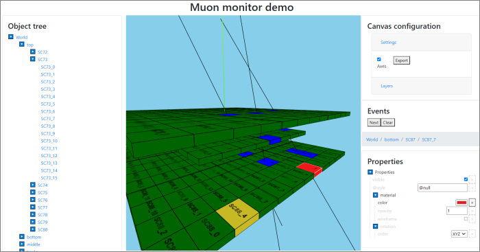

# DataForge Visualisation Platform

This repository contains [DataForge](http://npm.mipt.ru/dataforge/) 
(also [here](https://github.com/mipt-npm/dataforge-core)) components useful for visualization in
various scientific applications. The main application for now is 3D visualization for particle
physics experiments. Other applications including 2D plots are planned for future.

The project is developed as a Kotlin multiplatform application, currently 
targeting browser JavaScript and JVM.

Main features:
- 3D visualization of complex experimental set-ups
- Event display such as particle tracks, etc.
- Scales up to few hundred thousands of elements
- Camera move, rotate, zoom-in and zoom-out
- Object tree with property editor
- Settings export and import
- Multiple platform support
 

## Modules contained in this repository:

### dataforge-vis-common 

Common visualisation objects such as VisualObject and VisualGroup.

Class diagram: 

This module also includes configuration editors for JS (in jsMain) and JVM (in jvmMain).

Note: this module is not 3D-specific.

### dataforge-vis-spatial

Includes common classes and serializers for 3D visualisation, Three.js and JavaFX implementations.

Class diagram:

### dataforge-vis-spatial-gdml

GDML bindings for 3D visualisation (to be moved to gdml project).

### dataforge-vis-jsroot

Some JSROOT bindings. 

Note: Currently, this part is experimental and put here for completeness. This module may not build.

### demo

Several demonstrations of using the dataforge-vis framework:

##### spatial-showcase

Contains a simple demonstration (grid with a few shapes that you can rotate, move camera, etc.).
 
To see the demo: run `demo/spatial-showcase/distribution/installJsDist` Gradle task, then open
`build/distribuions/spatial-showcase-js-0.1.0-dev/index.html` file in your browser.

Other demos can be built similarly.  

##### muon-monitor

A full-stack application example, showing the 
[Muon Monitor](http://npm.mipt.ru/projects/physics.html#mounMonitor) experiment set-up.

Includes server back-end generating events, as well as visualization front-end. 

To run full-stack app (both server and browser front-end), run 
`demo/muon-monitor/application/run` task.

##### gdml

Visualization example for geometry defined as GDML file. Once you open Web application,
drag-and-drop GDML file to the window to see visualization. For example file, use 
`demo\gdml\src\jsMain\resources\cubes.gdml`.

