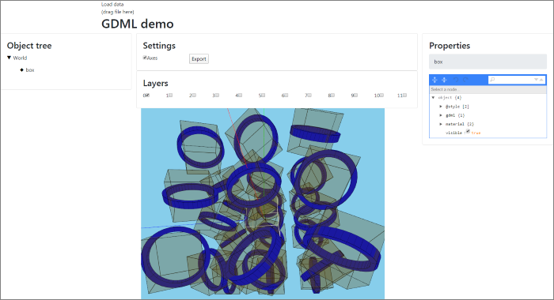

### GDML Example

Visualization example for geometry defined as GDML file. 

##### Building project

To build the app, run `demo/gdml/Tasks/kotlin browser/jsBrowserDistribution` Gradle task, then 
drag-and-drop GDML file to the window to see visualization. For an example file, you can use 
`demo/gdml/src/jsMain/resources/cubes.gdml`.

##### Example view:

