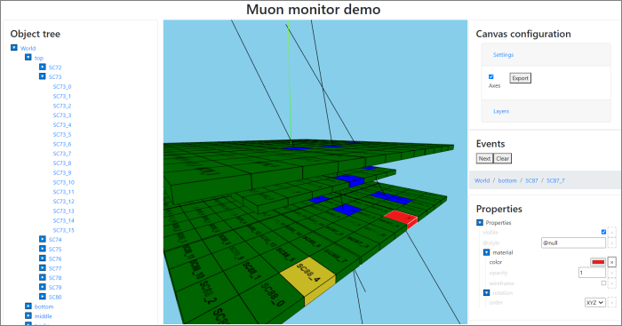

### Muon Monitor Visualization

This directory contains a full-stack application example built with `visionforge`.
It is visualizing the 
[Muon Monitor](http://npm.mipt.ru/projects/physics.html#mounMonitor) experiment set-up,
including experiment's geometry and events (particle tracks).

#### Reusing code and going Full-Stack with Kotlin Multiplatform

The application includes both server back-end generating events, as well as client 
visualization front-end.

As is common for Kotlin multiplatform projects, the code base of this simple application 
is put in the following main directories:
* `commonMain` - common code, used by both JS client and JVM server. For example, the `Monitor`
object describes general geometry definitions needed in all parts of the application.
* `jsMain` - JavaScript client code. It performs visualization and reads events from the server.  
* `jvmMain` - JVM server code. It runs `ktor` HTTP server, responding with event data when
client requests them.

Note that in a more traditional approach when client and server are developed separately
and possibly using different languages, there would be no common code and benefits associated
with it. 

##### Building project

To run full-stack Muon Monitor Visualization application (both JVM server and Web browser front-end), 
run `demo/muon-monitor/Tasks/application/run` task.

##### Example view:

