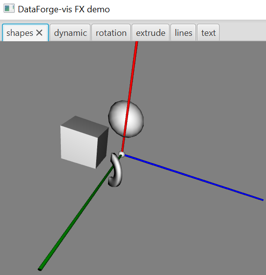

### Spatial Showcase

Contains a simple demonstration with a grid including a few shapes that you can rotate, move camera, and so on.
Some shapes will also periodically change their color and visibility.

##### Building project
 
To see the JS demo: run `demo/solid-showcase/Tasks/kotlin browser/jsBrowserRun` Gradle task, then open
`build/distribuions/solid-showcase-js-0.1.3-dev/index.html` file in your browser.

To see Java FX demo, run `demo/spatial-showcase/Tasks/application/run` Gradle task, or `main()` from `FXDemoApp.kt`.

##### Example view for JS:

##### Example view for Java FX:

