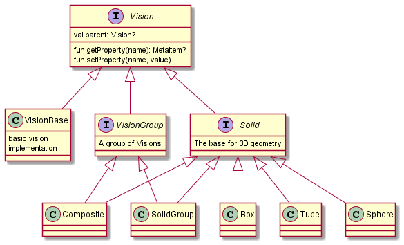

# Hierarchy

### Vision
* function `getPropertyValue(name: Name, inherit: Boolean = false, includeStyles: Boolean = true, includeDefaults: Boolean = true)` - get property value with given layer flags.

* function `setProperty(name: Name, item: Any?)` - a convenient method to set property node or value. If `item` is null, then node is removed, not a value
Sets the `item` property to the element with the `name` identification. 

### SolidGroup

* function `getPrototype(name: Name)` - get a prototype redirecting the request to the parent if prototype is not found. If prototype is a ref, then it is unfolded automatically.

* function `prototypes(builder: VisionContainerBuilder<Solid>.() -> Unit)` - create or edit prototype node as a group. 

### RootVisionGroup

Non-serializable root group used to propagate manager to its children.

* function Vision.root(manager: VisionManager) - designate this [VisionGroup] as a root group and assign a [VisionManager] as its parent.
