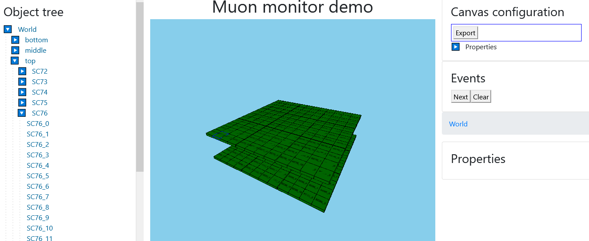
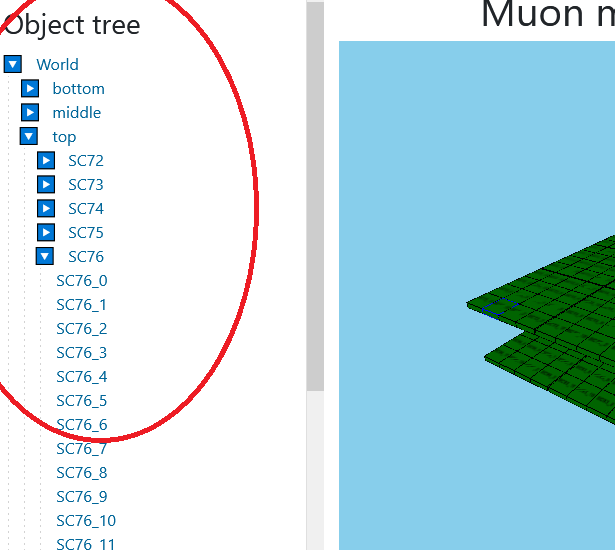
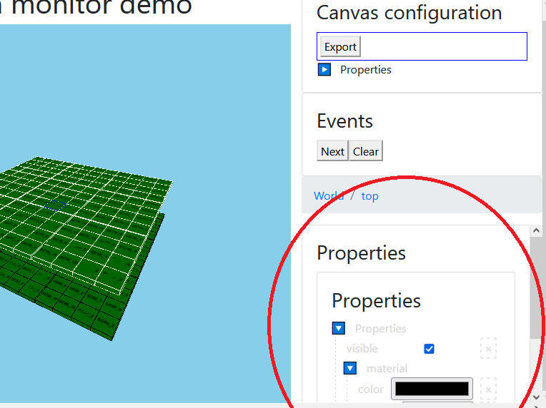
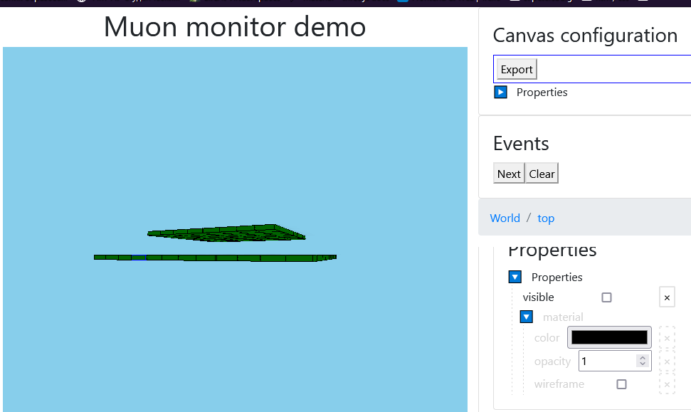
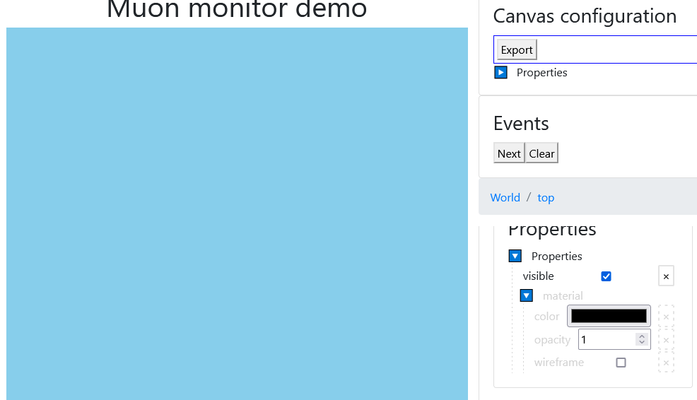
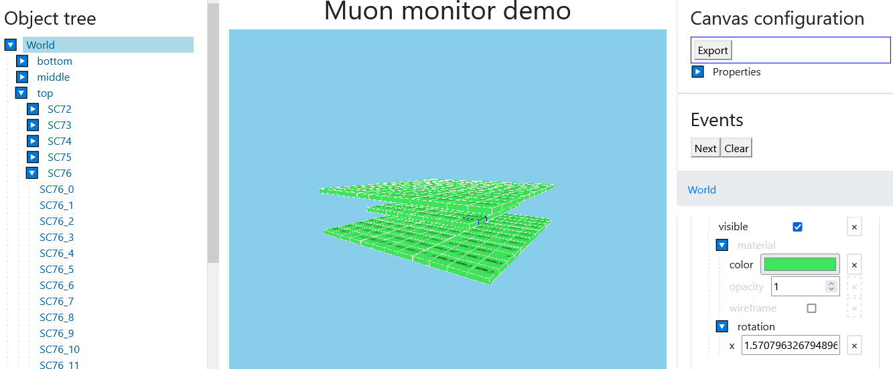
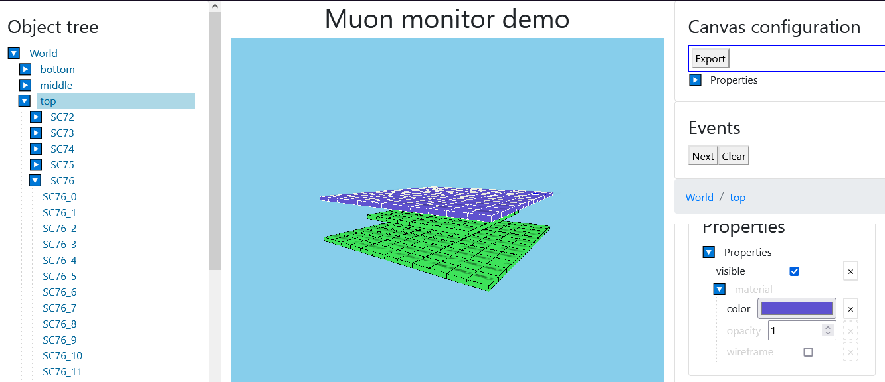
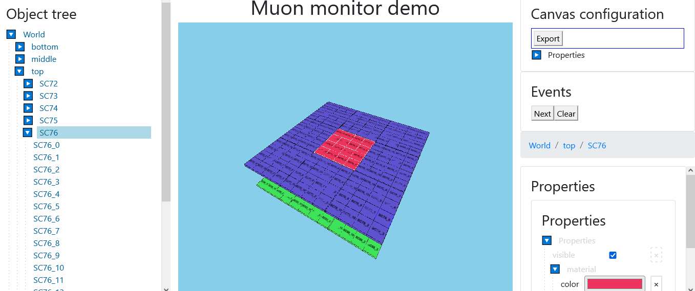
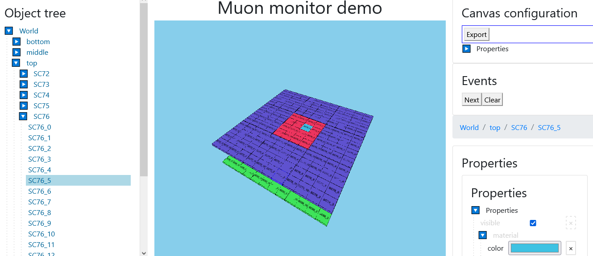
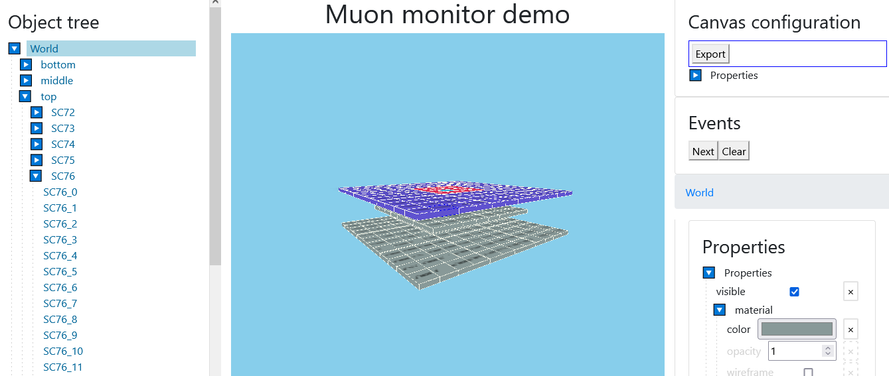

## Inheritance

Inheritance is an ability of an element to transfer a pack of properties to its `children` elements 'wrapped inside'.

Properties have to be set in a specific order:
### Main properties' inheritance:
* styles
* parents
* parent's styles
* defaults

As for `prototypes`, this property has to be set after styles, but before parents. So the order will be this:
### Reference properties' inheritance:
* styles
* prototypes
* parents
* parent's styles
* defaults
------------------------
Let's take a closer look using a [Muon Monitor Visualization](demo/muon-monitor/README.md).
Running the demo, we will see this:

You can see a tree of elements on the left; 'World' is a `root`, 'bottom', 'middle', and 'top' are 'World's `children` and so on.

On the right, there is a list with changeable properties.

Properties, which can or cannot be inherited, are these:
* `visible` - toggles the visibility of an element. To be exact, the invisibility of an element is inheritable.
  If a `parent` element is invisible, other elements are invisible as well, and they cannot be changed to visible mode.
  
  

* `material` - a group of properties, which can be inherited and which can be changed in `children` elements.
    * `color` - color of an element.
    * `opacity` - a number from 0 to 1 which represents percents of opacity (0 for 0%, 1 for 100%).
    * `wireframe` - toggles the wireframe mode.

  Let's see how elements of the `material` group inherit changing `color` property; ***other properties of this group inherit in the same way.***

  Let's change color of 'World' element:
  
  It is a `parent`, so 'bottom', 'middle', and 'top' elements inherit this color.

  Now, let's change 'top's color:
  
  It changes only, 'bottom' and 'middle' stays the same.

  'top' is a `parent` element as well: it has `children` - 'SC72', 'SC73', ... ,'SC80'.
  Let's change the color of 'SC76':
  
  Again, only 'SC76' has changed among other 'siblings'.

  However, 'SC76' is a `parent` too. Let's change one of its `children` color (here we change 'SC76_5's color'):
  

  As we can see, `color` is inheritable property, which can be changed in a custom way.

  If after all those changes we set at the 'World' element grey color, changes won't disappear:
  

* `rotation` - rotation of an element. Here, it is set by `x` value. It is inheritable and unable to be changed in `children` elements.
* `position` - position of an element, cannot be inherited.
