# Tutorial

#### The main goal of this tutorial is to show the main capabilities of the visualization instrument.

The simple visualization can be made with function `main`. (this part will be supplemented)
```kotlin
import kotlinx.html.div
import space.kscience.dataforge.context.Context
import space.kscience.visionforge.html.ResourceLocation
import space.kscience.visionforge.solid.*
import java.nio.file.Paths

fun main(){
    val context = Context{
        plugin(Solids)
    }

    context.makeVisionFile (
        Paths.get("nameFile.html"),
        resourceLocation = ResourceLocation.EMBED
    ){
        div {
           //first vision
            vision {
                solid {
                    //solids which you want to visualize
                }
            }
           //second vision
           vision {
              solid {
                 //solids which you want to visualize
              }
           }
        }
    }
}
```
## Solids properties
**We will analyze which basic properties solids have using `box` solid.**

*Basic properties:*
1. `opacity` - It is set in `float`. It takes on values from 0 to 1, which represent percents of solid opacity. It's initial value is 1.
2. `color` - It can be specified as `Int`, `String`, or as three `Ubytes`, which represent color in `rgb`. Elementally, the solid will have `green` color.
3. `rotation` - it's the point, which set rotations along axes. Initially, the value is `Point3D(0, 0, 0)`. Changing `x` coordinate of the point, you make pivot around `x axis`. The same for other coordinates: changing `y` - pivot around `y axis`, changing `z` - pivot around `z axis`.
4. position, which is given by values `x`, `y`, `z`. Initial values are `x = 0`, `y = 0`, `z = 0`. The coordinate system is Cartesian. It's elemental position is this - vertical `y` axis and horizontal `Oxz` plane.

Let's see how properties are set in solids.
The `small box` will have elemental values of properties. If you don't set properties, it will have the same `position`, `color`, `rotation`, and `opacity` values.

***You can see that `box` take four values. Later, we will discuss what they do in more detail. Now, it does not really matter.***
```kotlin
box(10, 10, 10, name = "small box"){
   x = 0
   y = 0
   z = 0
   opacity = 1 //100% opacity
   color("red") //as string
   rotation = Point3D(0, 0, 0)
}
```
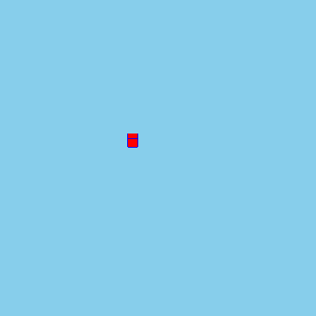

The `big box` will have properties with custom values. 
```kotlin
box(40, 40, 40, name = "big box"){
   x = 20
   y = 10
   z = 60
   opacity = 0.5 //50% opacity
   color(0u, 179u, 179u) //color in rgb
   rotation = Point3D(60, 80, 0)
}
```
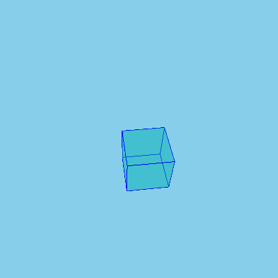
If we compare these boxes, we will see all differences. 

Here is the function `main` with both boxes.
```kotlin
fun main(){
    val context = Context{
        plugin(Solids)
    }

    context.makeVisionFile (
        Paths.get("customFile.html"),
        resourceLocation = ResourceLocation.EMBED
    ){
        div {
            vision {
                solid {
                   box(10, 10, 10, name = "small box"){
                      x = 0
                      y = 0
                      z = 0
                      opacity = 1 //100% opacity
                      color("red") //as string
                      rotation = Point3D(0, 0, 0)
                   }
                   box(40, 40, 40, name = "big box"){
                      x = 20
                      y = 10
                      z = 60
                      opacity = 0.5 //50% opacity
                      color(0u, 179u, 179u) //rgb
                      rotation = Point3D(60, 80, 0)
                   }
                }
            }
        }
    }
}
```
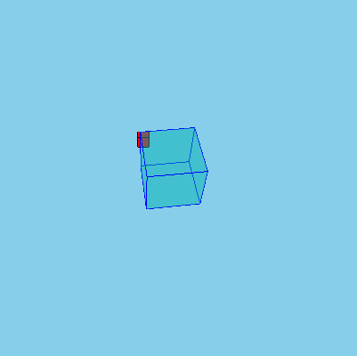
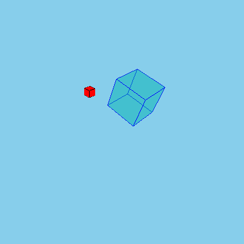

***There is plenty of other properties, especially of those, which you can create by yourself. Here we mention just small part.***

## Basic Solids
Now, let's see which solids can be visualized:
### 1) PolyLine

It's scarcely a solid, but it can be visualized, so we mention it.
`polyline` build lines, obviously. Let's take a look at it's work.

`polyline` requires two values - `points`, and `name`:
* `points` is a `vararg` with `Point3D` type. It takes pairs of points, which you want to connect.
* `name` is an identifier of *any solid*, but in this case it is an identifier of `polyline`.
It's type is `String`. **This value can be required by any solid;
you can set it, you can not to set it, but without you won't be able to control solid, since it won't be inherited.**

This is an example of polyline with other solid `box`:
```kotlin
box(100, 100, 100, name = "box"){
   x = -10
   y = -10
   z = -10
   opacity = 0.4
}
polyline(Point3D(30, 20, 10), Point3D(30, -100, 30), Point3D(30, -100, 30), Point3D(50, -100, 30), name = "polyline"){
   color("red")
}
```

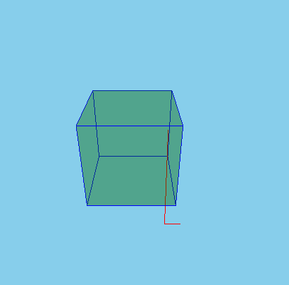
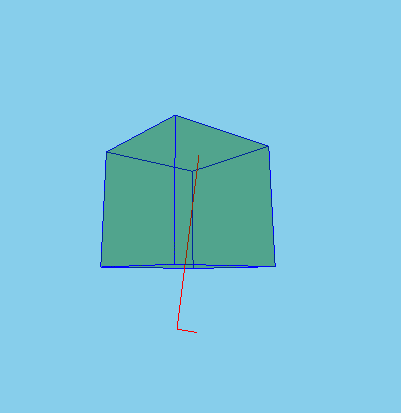

### 2) Box

First thing which has to be mentioned is that `box` takes four values: `box(x, y, z, name)`
* `x` - x-axis length of the `box`
* `y` - y-axis length of the `box`
* `z` - z-axis length of the `box`

These values have `Float` type. 

*`x`, `y`, and `z` are necessary values, which cannot be ignored. You have to set them.*

* `name` - `box`'es identifier. You've already met it. 

Let's create just usual `box` with equal ribs.

```kotlin
   box(50, 50, 50, name = "box") {
        color("pink")
   }
```
   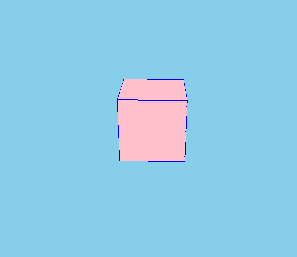

Now, let's make `box` with bigger `y` value.
   ```kotlin
   box(10, 25, 10, name = "high box") {
        color("black")
   }
   ```
As you can see, only rib of `y-axis` differs from other ribs.

   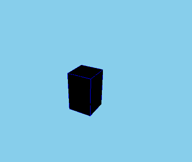

For final trial, let's create `box` with bigger `x` value.
   
   ```kotlin
   box(65, 40, 40, name = "wide box") {
        x = 0
        y = 0
        z = 0
        color("black")
   }
   ```
Predictably, only the `x-axis` rib is bigger than other ribs. 

   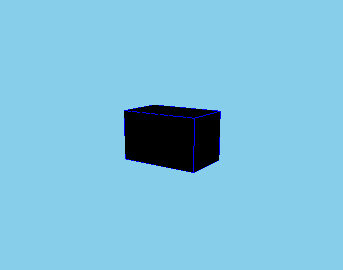
   
### 3) Sphere

It takes in two values: `radius`, and `name`. 
We bring you to mind that `name` is a general value for all solids, so do not wonder, since all solids need their own identifier.

As for `radius`, it has `Float` type, and, as you can guess, it sets the radius of the sphere which will be created.
   ```kotlin
   sphere(50, name = "sphere") {
        x = 0
        y = 0
        z = 0
        opacity = 0.9
        color("blue")
   }
   ```
   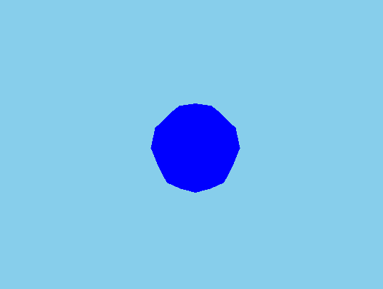

### 4) Hexagon

It is solid which has six edges. It is set by eight values: `node1`,..., `node8`. They all have `Point3D` type, so they are just points, vertices.

*Six edges are these:* 
1) Edge with vertices `node1`, `node4`, `node3`, `node2`
2) Edge with vertices `node1`, `node2`, `node6`, `node5`
3) Edge with vertices `node2`, `node3`, `node7`, `node6`
4) Edge with vertices `node4`, `node8`, `node7`, `node3`
5) Edge with vertices `node1`, `node5`, `node8`, `node4`
6) Edge with vertices `node8`, `node5`, `node6`, `node7`

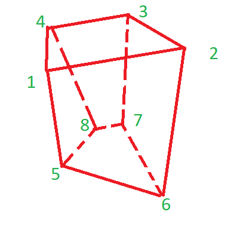

As the hexagon takes in specific points, we understand that this solid cannot be moved, it is fixed in space, and it can't make pivots.

Let's make classic parallelepiped.
```kotlin
   hexagon(
        Point3D(25, 30, 25),
        Point3D(35, 30, 25),
        Point3D(35, 30, 15),
        Point3D(25, 30, 15),
        Point3D(30, 18, 20),
        Point3D(40, 18, 20),
        Point3D(40, 18, 10),
        Point3D(30, 18, 10),
        name = "classic hexagon"){
        color("green")
   }
```
   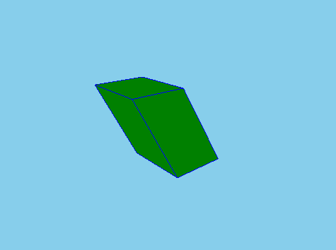

Now, let's make a custom hexagon.

   ```kotlin
hexagon(
    Point3D(5, 30, 5),
    Point3D(24, 30, 8),
    Point3D(20, 30, -10),
    Point3D(5, 30, -7),
    Point3D(8, 16, 0),
    Point3D(12, 16, 0),
    Point3D(10, 16, -5),
    Point3D(6.5, 12, -3),
    name = "custom_hexagon"
) {
    color("brown")
}
   ```
   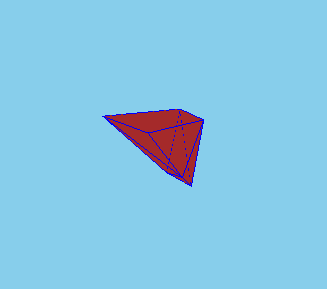
### 3) Cone
It takes in six values: `bottomRadius`, `height`, `upperRadius`, `startAngle`, `angle`, and `name`. 

Obviously, `bottomRadius` is responsible for the radius of a bottom base, and `height` sets the height of a cone along the `z-axis`.

As it takes such values as `upperRadius`, `startAngle`, `angle`, `cone` can build not only usual cones, but also cone segments. Initially, `upperRadius` will have `0.0` value, `startAngle` - `0f`, `angle` - `PI2`, so if you don't set them, you'll get just a simple cone. 

Setting `upperRadius`, you make a frustum cone, since it sets a radius of the upper base of a cone. Set `startAngle`, and `angle` let to cut off segments by planes perpendicular to the base. `startAngle` - an angle, starting with which segment will be left, `angle` - an angle of cone, which will be set from `startAngle`. 

Let's build a classic cone:
```kotlin
   cone(60, 80, name = "cone") {
         color("beige")
   }
   ```
   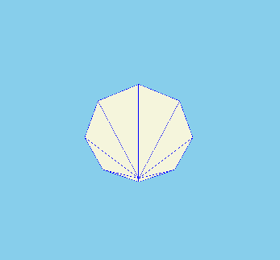
   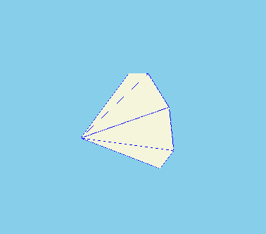

First of all, we have to try to build a frustum cone:
```kotlin
cone(60, 80, name = "cone") {
   color(0u, 40u, 0u)
}
```
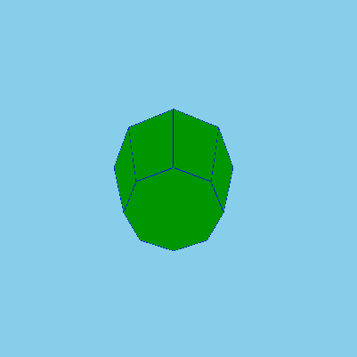

Now, we need to make a try to build a cone segment:

```kotlin
cone(60, 80, angle = PI, name = "cone") {
   color(0u, 0u, 200u)
}
```
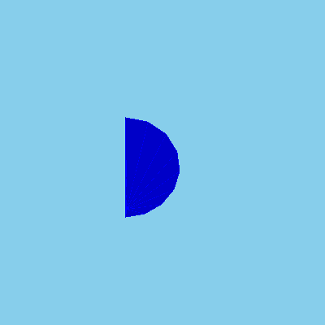
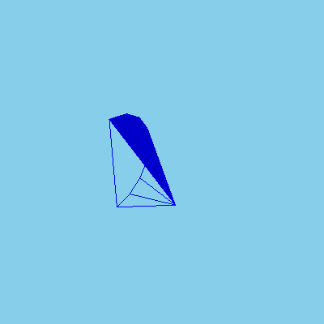

Finally, the segment of frustum cone is left for a try:
```kotlin
cone(60, 100, 20, PI*3/4, angle = PI/3, name = "cone") {
   color(190u, 0u, 0u)
}
```
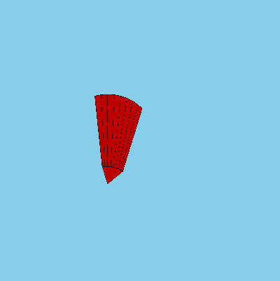

### 4) Cone Surface
This solid is set by seven values:`bottomOuterRadius`, `bottomInnerRadius`, `height`, `topOuterRadius`, `topInnerRadius`, `startAngle`, and `angle`.

In addition to `height`, `startAngle`, and `angle`, which work as they work in `cone`, there are some new values.
`bottomOuterRadius`, and `bottomInnerRadius` set properties of the bottom circle, `topOuterRadius`, `topInnerRadius` - of the upper circle. They have no initial value, so that means they have to be set.

Generally, `cone`, and `coneSurface` buildings work in the same way, it's possible to make `coneSurface`'s fragments as in `cone`

Let's build usual cone surface with almost all properties set:
```kotlin
   coneSurface(60, 50, 30, 10, 100, name = "cone surface") {
        color("red")
        rotation = Point3D(2, 50, -9)
   }
   ```
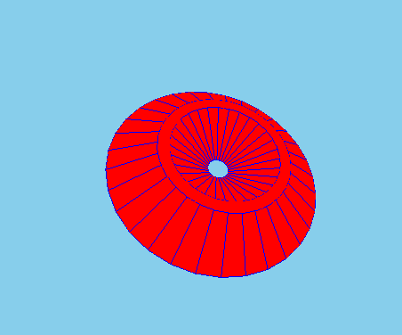
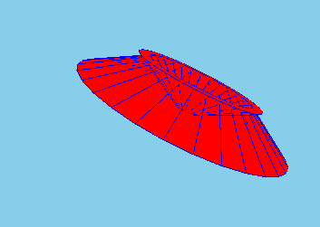

Now, let's create a cone surface and set all it's properties:

```kotlin
coneSurface(30, 25, 10, 10, 8,0f, pi*3/4, name = "cone surface") {
   color("fuchsia")
   rotation = Point3D(2, 50, -9)
}
```
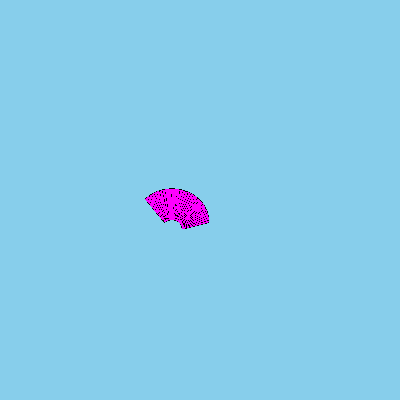
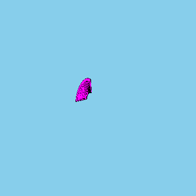

### 5) Cylinder

This solid is set by `radius`, and `height`. As you can see by accepting values, there's no option of building fragments of cylinders.

Here's a demonstration of a cylinder:

```kotlin
cylinder(40, 100, "cylinder"){
   rotation = Point3D(40, 0, 0)
   color("indigo")
}
```
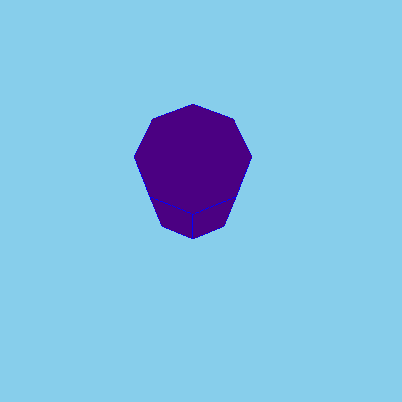
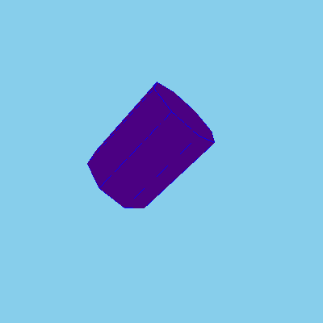
### 6) Tube

`tube` takes in `radius`, `height`, `innerRadius`, `startAngle`, `angle`, and `name`. *All values are familiar from `cone`, and `coneSurface` solids.*

Here is an example of classic tube:
```kotlin
tube(50, 40, 20, name = "usual tube"){
   opacity = 0.4
}                    
```
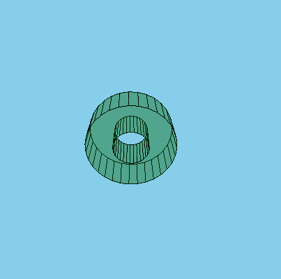

This is an example of tube fragment:

```kotlin
tube(50, 40, 20, 0f, PI, name = "fragmented tube"){    
   color("white")
}
```
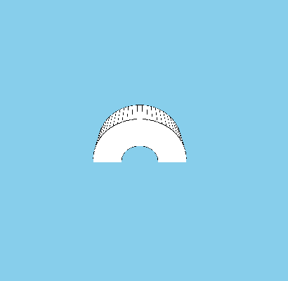
### 7) Extruded

`extruded` is set by two values: `shape`, and `layer`. 
* `shape` is a value of `List<Point2D>` type. It's just a list of all points of the solid. *`shape` has to consist of not less than two points!*
* `layer` is `MutableList` types variable. (here is a sentence with a description of the work of this function). *The amount of `layer`-s has to be more than one*
