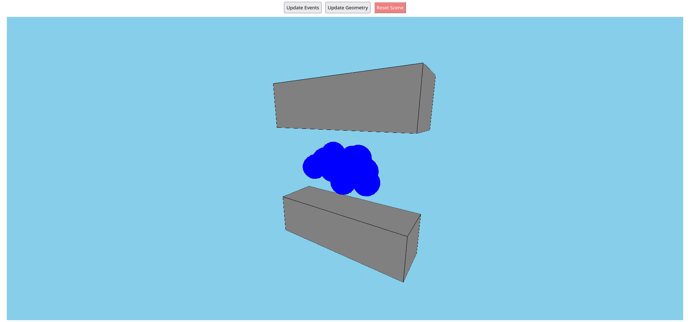
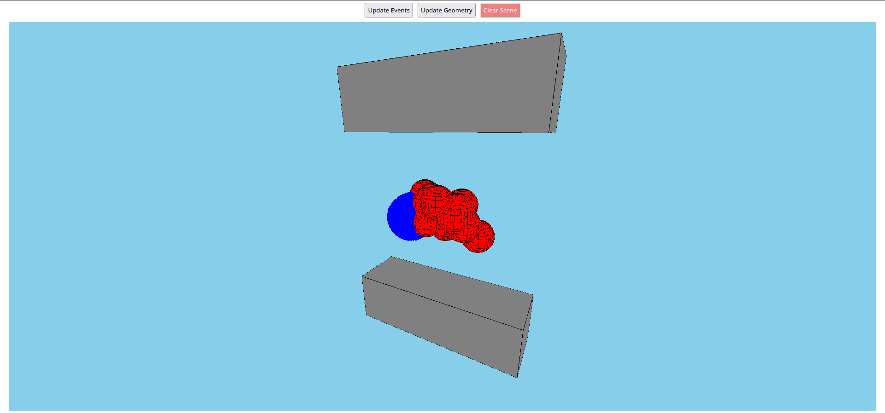

# Event Display Tutorial

In this tutorial, we will explore properties of Visions and build a simple front-end application. You may find a complete project [here](https://git.sciprog.center/teldufalsari/visionforge-event-display-demo).

__NOTE:__ You will need Kotlin Multiplatform 1.9.0 or higher to complete this tutorial!

### Starting the Project

We will use Idea's default project template for Kotlin Multiplatform. To initialize the project, go to *File -> New -> Project...*, Then choose *Full-Stack Web Application* project template and
*Kotlin Gradle* build system. Then select *Next -> Finish*. You will end up with a project with some sample code.

To check that everything is working correctly, run *application -> run* Gradle target. You should see a greeting page when you open `http://localhost:8080` in a web browser.

We will use Kotlin React as our main UI library and Ktor Netty both as a web server. Our event display frontend and server will reside in `jsMain` and `jvmMain` directories respectively.
Before we start, we have to load necessary dependencies:

* Add SciProgCentre maven repo in `build.gradle.kts` file:
```kotlin
repositories {
    mavenCentral()
    maven("https://maven.pkg.jetbrains.space/public/p/kotlinx-html/maven")

    // Add either the line below:
    maven("https://repo.kotlin.link")

    // Or this line:
    maven("https://maven.sciprog.center/kscience")

}
```

* Add `visionforge-threejs-server` into the list of JS dependencies of your project:
```kotlin
kotlin {
    sourceSets {
        val jsMain by getting {
            dependencies {
                implementation("space.kscience:visionforge-threejs-server:0.3.0-dev-14")
            }
        }
    }
}
```

Refresh build model in the Idea to make sure the dependencies are successfully resolved.

__NOTE:__ In previous versions of VisionForge, some imports may be broken. If these dependencies fail to resolve, replace `space.kscience:visionforge-threejs-server:0.3.0-dev-14` with `space.kscience:visionforge-threejs:0.3.0-dev-14`. The resulting bundle will lack a React component used in the tutorial (see "Managing Visions"). You may copy and paste it directly from either [VisionForge](https://git.sciprog.center/kscience/visionforge/src/branch/master/ui/react/src/main/kotlin/space/kscience/visionforge/react/ThreeCanvasComponent.kt) or the [tutorial repo](https://git.sciprog.center/teldufalsari/visionforge-event-display-demo/src/branch/main/src/jsMain/kotlin/canvas/ThreeCanvasComponent.kt), or even come up with a better implementation if your own.

### Setting up Page Markup

We need to create a page layout and set up Netty to serve our page to clients. There is nothing special related to VisionForge, so feel free to copy and paste the code below.

File: `src/jvmMain/.../Server.kt`
```kotlin
// ... imports go here

fun HTML.index() {
    head {
        // Compatibility headers
        meta { charset = "UTF-8" }
        meta {
            name = "viewport"
            content = "width=device-width, initial-scale=1.0"
        }
        meta  {
            httpEquiv = "X-UA-Compatible"
            content = "IE=edge"
        }
        title("VF Demo")
    }
    // Link to our react script
    body {
        script(src = "/static/vf-demo.js") {}
    }
}

fun main() {
    // Seting up Netty
    embeddedServer(Netty, port = 8080, host = "127.0.0.1") {
        routing {
            get("/") {
                call.respondHtml(HttpStatusCode.OK, HTML::index)
            }
            static("/static") {
                resources()
            }
        }
    }.start(wait = true)
}
```

File: `src/jsMain/.../Client.kt`
```kotlin

fun main() {
    val container = document.createElement("div")
    document.body!!.appendChild(container)

    val eventDisplay = EventDisplay.create {}
    createRoot(container).render(eventDisplay)
}
```

File: `src/jsMain/.../Display.kt`
```kotlin
// All markup goes here:
val EventDisplay = FC<Props> {
    // Global CSS rules
    Global {
        styles {
            "html,\n" +
            "body" {
                height = 100.vh
                width = 100.vw
                margin = 0.px
            }
            "body > div" {
                height = 100.vh
                width = 100.vw
                display = Display.flex
                flexDirection = FlexDirection.column
                justifyContent = JustifyContent.start
                alignItems = AlignItems.center
            }
            "*,\n" +
            "*:before,\n" +
            "*:after" {
                boxSizing = BoxSizing.borderBox
            }
        }
    }

    div {
        css {
            height = 100.pct
            width = 100.pct
            display = Display.flex
            flexDirection = FlexDirection.column
            alignItems = AlignItems.center
        }
        div {
            css {
                width = 100.pct
                display = Display.flex
                flexDirection = FlexDirection.row
                alignItems = AlignItems.center
                justifyContent = JustifyContent.center

            }
            input {
                css {
                    margin = 5.px
                    padding = 5.px
                }
                type = InputType.button
                value = "Update Events"
            }
            input {
                css {
                    margin = 5.px
                    padding = 5.px
                }
                type = InputType.button
                value = "Update Geometry"
            }
        }
        div {
            css {
                width = 98.pct
                height = 1.pct
                margin = 5.px
                display = Display.flex
                flexGrow = number(1.0)
                justifyContent = JustifyContent.center
                alignItems = AlignItems.center
                backgroundColor = Color("#b3b3b3")
            }

        }
    }
}
```

After setting everything up, you should see a gray rectangle with two buttons above it when opening `localhost:8080`.

### Managing Visions

We are approaching the main part of the tutorial - the place where we will create a working demo. In particle accelerator experiments, event displays are employed to visualise particle collision events. Essentially, it requires drawing a detector setup and visual interpretation of events: tracks, detector hits etc. Usually, a number of events share a common detector setup (e.g. if these events occured in a single experiment run). It makes sense to update and re-render only event information, while keeping detector geometry constant between updates.

Visions (namely, the `SolidGroup` class) allow us to create an object tree for our displayed event. `SolidGroup` can hold other Visions as its child nodes, access these nodes by names and update/delete them. We will use this property to update our event display efficiently.

To display Visions as actual 3D object, we will use `ThreePlugin` that renders Visions using *three.js* library. The plugin allows us to create a Three.js representation of a vision that will observe changes of its correspondent Vision. This way we can update only Visions without diving deep into three.js stuff. Using observable Visions is also efficient: Three.js representations are not generated from scratch after each Vision update but are modified too.

First, let's simulate data load operations:
* Add state variables to our `EventDisplay` React component. These variables will be treated as data loaded from a remote server. In real life, these may be JSON string with event data:
```kotlin
val EventDisplay = FC<Props> {
    // ...

    var eventData: kotlin.Float? by useState(null)
    var geometryData: kotlin.Float? by useState(null)

    // ...
}
```
* Write two simple functions that will convert data to a Vision. In this case, we will simply parameters of solids like color of size; in real life, these functions will usually take raw data and convert it into Visions.
```kotlin
fun generateEvents(radius: Float): SolidGroup {
    val count = Random.nextInt(10, 20)
    return SolidGroup {
        repeat(count) {
            sphere(radius) {
                x = 5.0 * (Random.nextFloat() - 0.5)
                y = 2.0 * (Random.nextFloat() - 0.5)
                z = 2.0 * (Random.nextFloat() - 0.5)
                color(Colors.red)
            }
        }
    }
}

fun generateGeometry(distance: Float): SolidGroup {
    return SolidGroup {
        box(10, 3, 3) {
            x = 0.0
            y = -distance
            z = 0.0
            color(Colors.gray)
        }
        box(10, 3, 3) {
            x = 0.0
            y = distance
            z = 0.0
            color(Colors.gray)
        }
    }
}
```
* Then, let's create our main Vision and add a static light source:
```kotlin
val EventDisplay = FC<Props> {
    // ...

    val containedVision: SolidGroup by useState(SolidGroup {
        ambientLight {
            color(Colors.white)
        }
    })

    // ...
}
```

* A `Context` object is required to hold plugins like `ThreePlugin`. It is also necessary to make Visions observable: we have to root our main Vision in the context. Declare a global `Context` in the same file with `EventDisplay` component:
```kotlin
val viewContext = Context {
    plugin(Solids)
    plugin(ThreePlugin)
}

```

* Import `ThreeCanvasComponent` from VisionForge. This is a React component that handles all display work. It creates three.js canvas, attaches it to its own parent element and creates and draws `Object3D` on the canvas. We will attach this component to a
separate React component. Note order for Visions to update their Three.js representations, these Visions need to be rooted in a `Context`. This way Visions will be observed for changes, and any such change will trigger an update of the corresponding Three.js object.
```kotlin
external interface EventViewProps: Props {
    var displayedVision: Solid?
    var context: Context
}

val EventView = FC<EventViewProps> { props ->
    ThreeCanvasComponent {
        solid = props.displayedVision
        context = props.context
    }
    // Make displayedVision observed:
    useEffect(props.displayedVision) {
        props.displayedVision?.setAsRoot(props.context.visionManager)
    }
}
```

__NOTE:__ If you had problems with dependency resolution, `ThreeCanvasComponent` may missing from your import scope. You may find a compatible implementation [here](https://git.sciprog.center/teldufalsari/visionforge-event-display-demo/src/branch/main/src/jsMain/kotlin/canvas/ThreeCanvasComponent.kt).

* Finally, we need to attach EventView to our main component and connect raw data updates to Vision updates using React hooks:
```kotlin
// ...

// Names used as keys to access and update Visions
// Refer to DataForge documentation for more details
val EVENTS_NAME = "DEMO_EVENTS".parseAsName(false)
val GEOMETRY_NAME = "DEMO_GEOMETRY".parseAsName(false)

// ...

val EventDisplay = FC<Props> {
    // ...

    useEffect(eventData) {
        eventData?.let {
            containedVision.setChild(EVENTS_NAME, generateEvents(it))
        }
    }
    useEffect(geometryData) {
        geometryData?.let {
            containedVision.setChild(GEOMETRY_NAME, generateGeometry(it))
        }
    }
    // ...

    div {
        // ...

        div {
            css {
                width = 98.pct
                height = 1.pct
                flexGrow = number(1.0)
                margin = 5.px
                display = Display.flex
                justifyContent = JustifyContent.center
                alignItems = AlignItems.center
            }
            // Replace the gray rectangle with an EventView:
            EventView {
                displayedVision = containedVision
                context = viewContext
            }
        }
    }
// ...
}
```

When we press either of the buttons, corresponding raw data changes. This update triggers `UseEffect` hook, which generates new event or geometry data and replaces the old data in the main Vision. Three.js representation is then updated to match our new Vision, so that changes are visible on the canvas.

Recompile the project and go on `http://localhost:8080`. See how the displayed scene changes with each click: for example, when you update geometry, only the distance between "magnets" varies, but spheres remain intact.

### Clearing the Scene

We can erase children Visions from the scene completely. To do so, we cat pass `null` to the function `setChild` as `child` argument. Add these lines to the hooks that update Visions to remove the corresponding Vision from our diplayed `SolidGroup` when raw data changes to `null`:
```kotlin
useEffect(eventData) {
    // ...

    if (eventData == null) {
        containedVision.setChild(EVENT_NAME, null)
    }
}
useEffect(geometryData) {
    // ...

    if (geometryData == null) {
        containedVision.setChild(GEOMETRY_NAME, null)
    }
}
```
To test how this works, let's create an erase button that will completely clear the scene:
```kotlin
val EventDisplay = FC<Props> {
    // ...

    div {
        // ...

        input {
            css {
                margin = 5.px
                padding = 5.px
                backgroundColor = NamedColor.lightcoral
                color = NamedColor.white
            }
            type = InputType.button
            value = "Clear Scene"
            onClick = {
                geometryData = null
                eventData = null
            }
        }
    }

    // ...
}
```


### Making Selection Fine-Grained

You may feel annoyed by how selection works in our demo. That's right, selecting the whole detector or the entire event array is not that useful. This is due to the fact that VisionForge selects object based on names. We used names to distinguish SolidGroups, but in fact not only groups but every single Vision can have a name. But when we were randomly generating Vision, we did not use any names, did we? Right, Vision can be nameless, in which case they are treated as a monolithic object together with their parent. So it should be clear now that when we were selecting a single rectangle, we were in fact selecting the whole pair of rectangles and the other one went lit up as well.

Fortunately, every `Solid` constructor takes a `name` parameter after essential parameters, so it should be easy to fix it. Go to the generator functions and add the change construction invocations to the following:
```kotlin
fun generateGeometry(distance: Float): SolidGroup {
    return SolidGroup {
        box(10, 3, 3, "Magnet1") {
            // ...
        }
        box(10, 3, 3, "Magnet2") {
            // ...
        }
    }
}
```
For the events part, we will use the index in a loop as a name:
```kotlin
fun generateEvents(radius: Float): SolidGroup {
    // ...
    repeat(count) {
        sphere(radius, it.toString()) {
            // ...
}
```

After you update the build, it should be possible to select only one sphere or rectangle:

